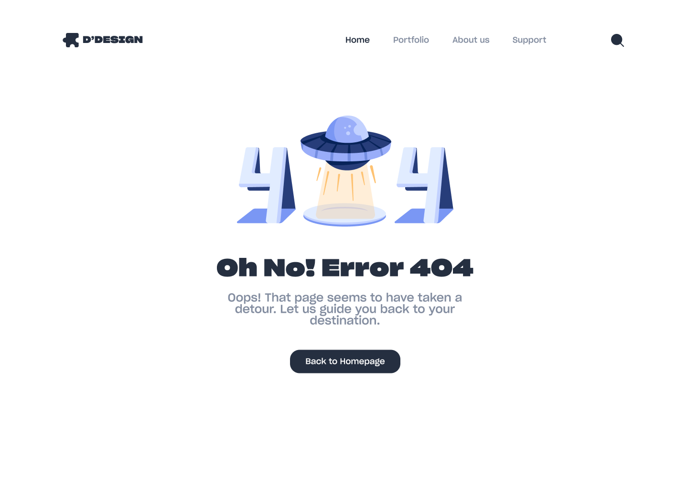
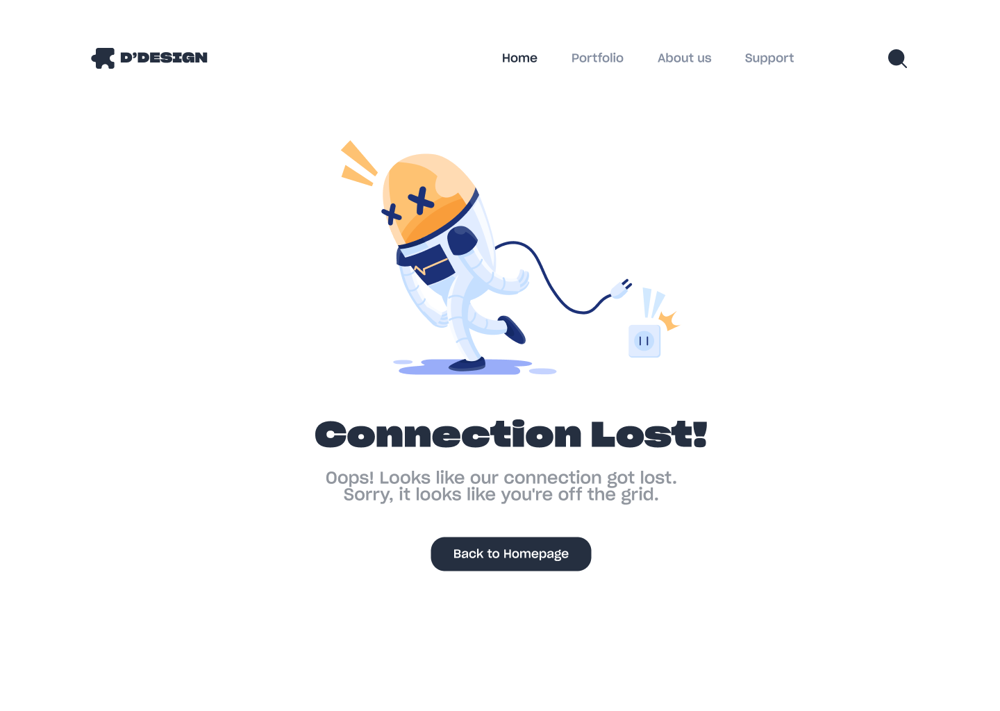
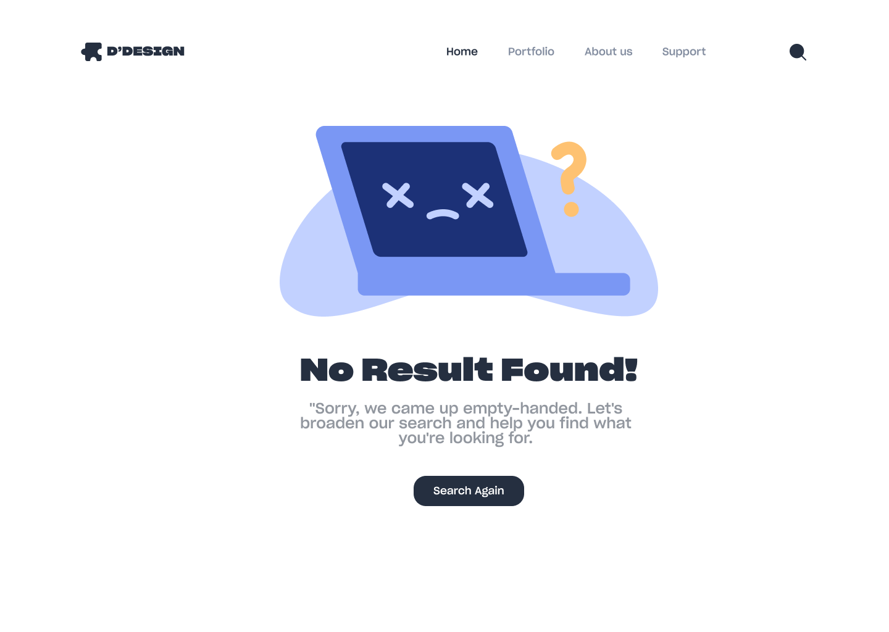
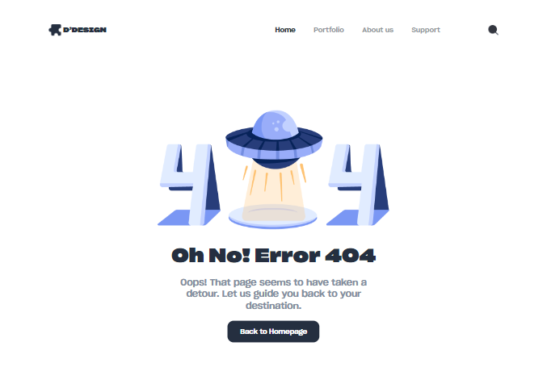
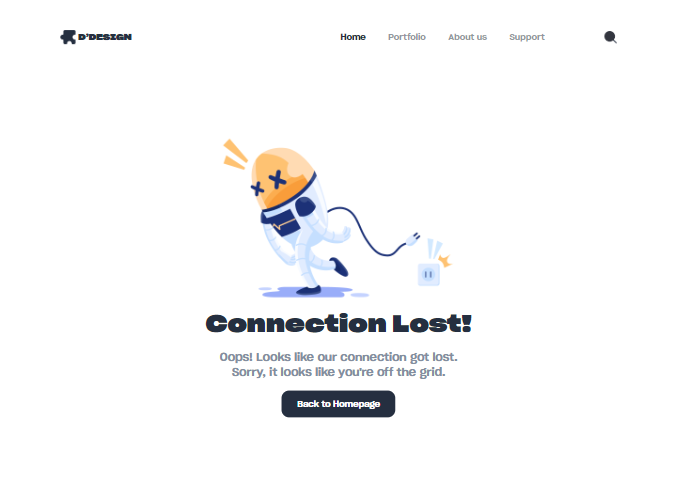
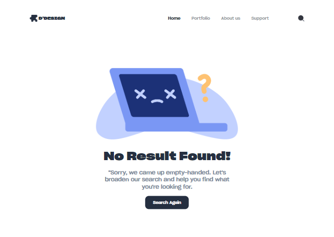

# Réplica de Diseño Web de Figma

**Réplica de un diseño web basado en un archivo de Figma de la comunidad.**

Este proyecto consiste en la implementación del diseño "Page State UI Web Design (Community)" proveniente de Figma Community. La réplica fue realizada utilizando HTML, CSS y JS, optimizada para ser responsive. El diseño consiste en 3 tipos de páginas diferentes para mostrar cuando ocurra un error, se pierda la conexión o no se encuentre algún resultado.

## Enlaces del proyecto
<a href="https://waldo-noe-liberato-jara.github.io/Page-State-UI-Design---Responsive/error-404.html" target="_blank">Error 404</a>

<a href="https://waldo-noe-liberato-jara.github.io/Page-State-UI-Design---Responsive/lost-connection.html" target="_blank">Lost Connection</a>

<a href="https://waldo-noe-liberato-jara.github.io/Page-State-UI-Design---Responsive/no-results.html" target="_blank">No Results</a>

## Capturas de pantalla

### Diseño original en Figma:

### Resultado de mi réplica:

Link del diseño original: [Figma Design](https://www.figma.com/design/E2nkW0Wc3pxIrGxBIUBEOa/Page-State-UI-Web-Design-(Community)?node-id=0-1&node-type=canvas&t=Eq2ive24EWBTAX7H-0)
